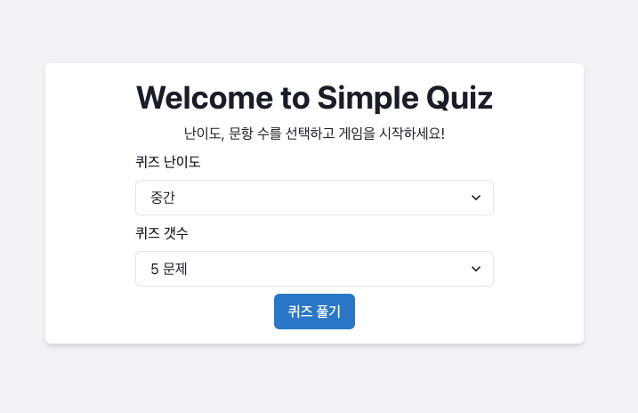
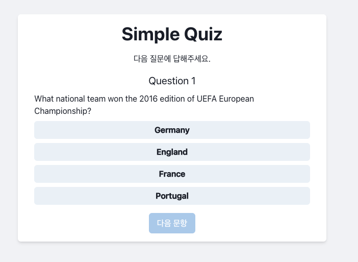
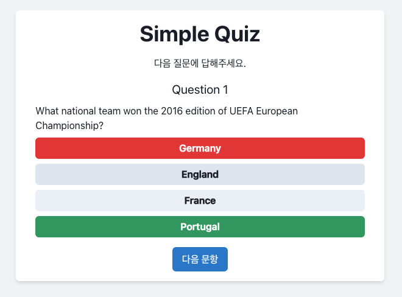
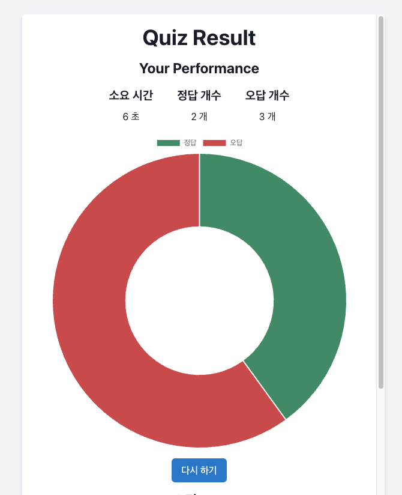
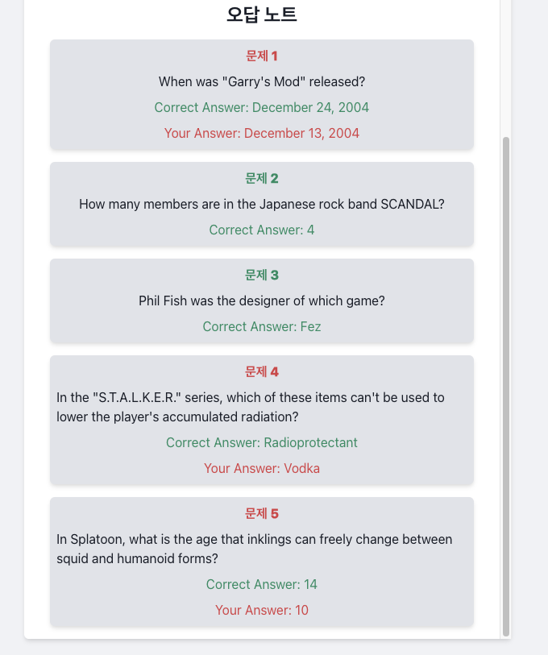

# [Simple-quizz](https://xun415.github.io/simple-quizz/)

## 환경 및 기술 스택
### 프로젝트 환경 구축: Node 18 LTS, PNPM, Vite  
### 프로젝트 기술 스택: React, Typescript, Zustand, Chakra-ui, React-hook-form, Vitest, MSW, chart.js, ...  
### 백엔드 api: [Open Trivia DB](https://opentdb.com/api_config.php)

## 화면 소개
### 인덱스 페이지

- 퀴즈 난이도 선택 (전체, 쉬움, 중간, 어려움)
- 퀴즈 갯수 선택 (1 ~ 10 개)
- 퀴즈 풀기 버튼 클릭 시 퀴즈 시작

### 퀴즈 페이지

- 질문 및 답 선택 버튼
- 오답 선택 시 유저 선택 버튼은 빨간색으로, 정답은 초록색으로 변경됨
- 정답 선택 시 해당 버튼 색이 초록색으로 변경됨
- 답 선택 후 '다음 문항' 버튼 클릭 시 다음 문제 진행
- 인덱스 페이지에서 선택한 문제 갯수만큼 퀴즈가 진행되었으면, 다음 문항 선택 시 결과 페이지로 이동

### 퀴즈 결과 페이지

- 소요 시간, 정답 개수, 오답 개수 표시
- 정답 개수, 오답 개수 파이 차트 표시
- '다시 하기' 버튼 클릭 시 인덱스 페이지로 이동
- 오답 노트 영역 표시